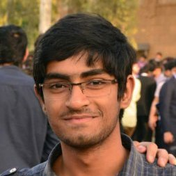

## About Me

Hey! I am Rishabh, and I'm a senior year undergraduate student of B.E. Computer Science at [Birla Institute of Technology and Science, Pilani](http://www.bits-pilani.ac.in/pilani). I am broadly interested in theory and applications of Machine Learning.
More recently, I have been working on a few projects involving Sensor Fusion and basic Computer Vision techniques. I also regularly take part in sport programming (competitive programming)
competitions ([spoj](http://www.spoj.com/users/rishabh__joshi), [codeforces](http://www.codeforces.com/profile/rishabhjoshi)). I have also done projects in the field of Robotics and IoT. I like to explore different fields and keep learning!

I have also had the opportunity to work on some interesting problems at IIRS, ISRO (Indian Space Research Organization) and Samsung Research Institute, Bangalore.

I'm very passionate to make a significant impact in the field of Computer 
Science.

---

## Research Interest

My research interests are mainly in the field of Machine Learning and IoT with a focus on applications of ML techniques to various domains including pervasive computing systems.
Of late, I have also started taking interest in ANNs and Deep Neural Networks because of the intriguing way they 
work and mimic humans in cognitive tasks, especially those related to __Vision__ and __Language__. 

---

## PORs

Post | Organization | Duration
--- | --- | ---
Teaching Assistant | Data Structures and Algorithms | January 2017 - May 2017
Executive Coordinator | [Embryo Club, BITS Pilani](http://embryo.bits-pilani.ac.in) | April 2016 - April 2017
Joint Activities Coordinator | [ACM BITS Pilani Chapter](http://bitsacm.acm.org/) | August 2015 - August 2016
Executive Committee Member | [NSS BITS Pilani Chapter](http://www.nss-bits-pilani.org/) | August 2015 - August 2016

---
You can find the full source code of this site on [GitHub](https://github.com/rishabhjoshi/rishabhjoshi.github.io)

---
